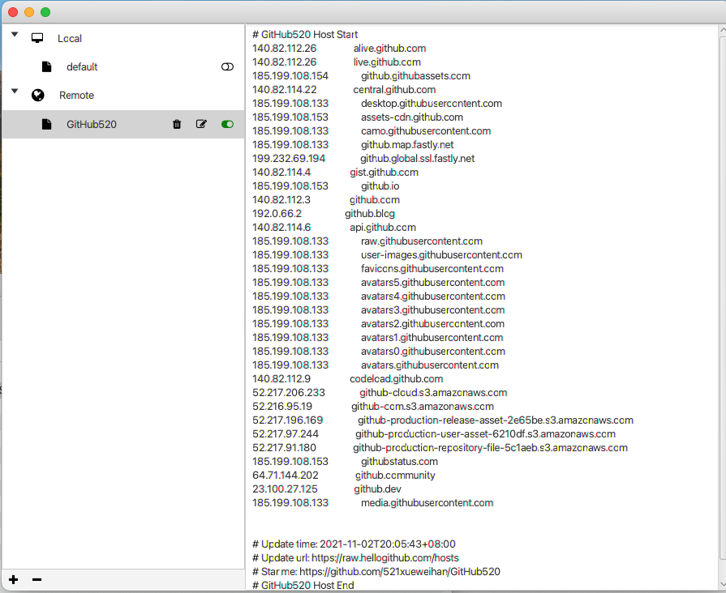

## ui

##数据存储位置
##说明
`使用sudo 超级管理员打开`
~/.jtools/switchost/
### 具体数据结构
### hosts/
hosts 映射文件，id为文件名
### switch_host.configure
#### 具体数据结构

| key      | value | description     | 
| :---        |    :----:   |          ---: |
| current_hosts      | default       | 当前hosts文件id   |

### hosts.db
hosts的映射关系

### 命令行
参数 | 说明
:---| :---
无 | 没有参数，则启动图形界面操作
-h | 显示帮助文档
-r | 刷新当前正在应用的远程hosts文件
